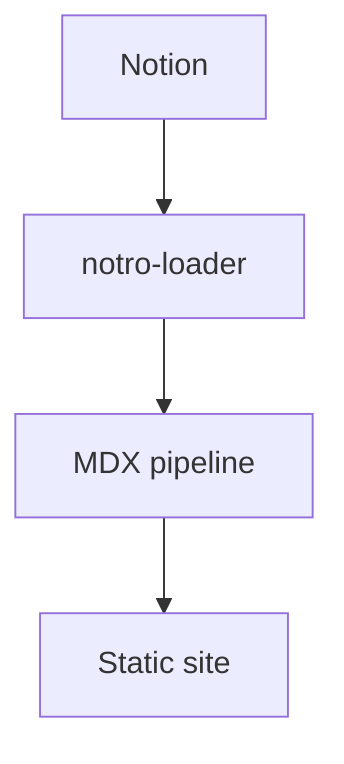

# Supported Notion Block Types

notro supports a wide range of Notion block types. This post gives an overview of what you can use in your blog posts.

## Text formatting

Standard Markdown formatting works as expected:

- **Bold**, *italic*, ~~strikethrough~~, `inline code`
- [Links](https://github.com/mosugi/notro)
- Inline math: $E = mc^2$

## Headings

H1, H2, H3 headings are rendered with anchor links (added by `rehype-slug`). The `TableOfContents` block generates a linked outline automatically.

## Lists

- Unordered lists
- Ordered lists
- [x] Task lists (checked)
- [ ] Task lists (unchecked)
- Nested lists

## Code blocks

```typescript
import { loader } from "notro-loader";

const posts = defineCollection({
  loader: loader({
    queryParameters: {
      data_source_id: import.meta.env.NOTION_DATASOURCE_ID,
      filter: { property: "Public", checkbox: { equals: true } },
    },
    clientOptions: { auth: import.meta.env.NOTION_TOKEN },
  }),
});
```

Syntax highlighting is powered by `@shikijs/rehype`.

## Math blocks (KaTeX)

$$
\int_0^\infty e^{-x^2} dx = \frac{\sqrt{\pi}}{2}
$$

## Callouts

:::callout{emoji="💡"}
Callouts are great for highlighting important information. notro maps Notion callout blocks to styled components.
:::

## Toggles

Toggles render as `<details>` elements, providing collapsible sections without JavaScript.

## Tables

| Feature | Status |
|---|---|
| Callout | ✅ |
| Toggle | ✅ |
| Columns | ✅ |
| Table | ✅ |
| Math | ✅ |
| Mermaid | ✅ |

## Columns

Notion column layouts are supported and render side-by-side on wide screens, stacking vertically on mobile.

## Mermaid diagrams



`rehype-beautiful-mermaid` renders diagrams to inline SVG at build time — no client-side JavaScript required.

## Images

Images uploaded to Notion are served via pre-signed S3 URLs. notro's image service strips the expiring `X-Amz-*` query parameters before computing the Astro image cache key, so repeated builds reuse cached images.

## Synced blocks

Content inside Notion's synced blocks is inlined at build time. The `<synced_block>` wrapper is stripped and the content is rendered as normal Markdown.
